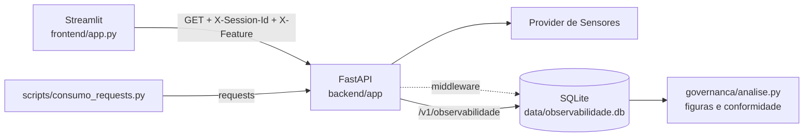

# Sensor Monitoring API: observabilidade do provider de Sensores

Checkpoint integrado das disciplinas de Governança em IA e Front-end (FIAP, Tecnólogo em Inteligência Artificial). O projeto expõe o provider de Sensores do Forzy Digital Twin como uma API FastAPI, registra metadados de cada chamada em SQLite e mostra leitura atual, histórico e relatório de observabilidade numa interface Streamlit.

## Integrantes

- Matheus Cardoso Gomes, RM 564898
- Caique Sousa, RM 563621

## Arquitetura

O front (Streamlit, ou o script de consumo) chama a API com `requests` e manda dois headers de contexto em toda chamada: `X-Session-Id`, que identifica a sessão de quem chamou, e `X-Feature`, que identifica a funcionalidade de origem (por exemplo `tela-historico`). A API repassa a consulta ao provider de Sensores. Um middleware envolve as rotas `/v1/sensores/*`, mede a latência com `time.perf_counter` e grava um registro por chamada na tabela `chamadas` do SQLite. A rota `/v1/observabilidade` lê essa tabela, e a rota `/v1/observabilidade/resumo` calcula os indicadores do metric contract (`governanca/metric_contract.yaml`).



O provider de Sensores serve os dois sensores do motor WEG W22 do projeto, S1 (componente 2) e S2 (componente 3), com velocidade de vibração (mm/s), aceleração (g) e temperatura (°C). Os valores são reais: vêm do histórico exportado do mestre IO-Link em 19/05/2026 (`backend/app/providers/dados/historico_forzy_2026-05-19.csv`), o mesmo arquivo que o modo demo do forzy-api repete, porque o hardware da Forzy hoje devolve dado zerado. O provider imita o `forzy_poller.py`: a cada 10 s lê o último valor de cada sensor e grava a leitura, repetindo o histórico em laço sobre o relógio atual. O que é simulado é a coleta (endpoint fora do ar por alguns minutos, poll perdido) e o custo da consulta (latência variável e 503 ocasional). Sem essas falhas os indicadores de qualidade de dado ficariam sempre perfeitos e não haveria o que governar.

Os limiares de severidade são os do Metric Contract da Sprint 3: vibração de 1,8 e 4,5 mm/s (ISO 10816-1 Classe I), temperatura de 70 e 90 °C, aceleração de 2 e 4 g. Abaixo de 0,3 mm/s o motor é considerado desligado. O sensor é marcado como offline quando a última leitura tem mais de 30 s.

Fora do escopo deste checkpoint: autenticação e os providers de Equipamentos e Plantas (ficam para a Sprint 4).

### Chamadas sem headers

A API não rejeita chamada sem `X-Session-Id` ou `X-Feature`. A chamada é atendida e o registro guarda o valor `ausente` no campo que faltou, com `headers_completos = false`. A decisão foi tomada porque a cobertura de headers é um dos indicadores do contrato: se a API recusasse essas chamadas, o problema sumiria do relatório em vez de aparecer nele, e não daria para descobrir qual cliente está chamando sem contexto (o `user_agent` fica registrado). O contrato prevê passar a recusar com 400 se a cobertura ficar abaixo do limiar crítico por mais de uma sprint.

## Endpoints

| Rota | O que devolve |
|---|---|
| `GET /v1/sensores` | sensores S1 e S2 com os limiares de cada grandeza |
| `GET /v1/sensores/{tag}/leitura-atual` | vibração, aceleração, temperatura, timestamp da leitura, severidade por grandeza e geral (`normal`, `alerta`, `critico`, `indeterminada`), motor ligado ou não, idade do dado e se o sensor está offline |
| `GET /v1/sensores/{tag}/historico?inicio=&fim=&limite=` | leituras do intervalo em ordem cronológica (padrão: última hora, 120 leituras) |
| `GET /v1/observabilidade?feature=&session_id=&desde=&limite=` | registros das chamadas às rotas de sensores |
| `GET /v1/observabilidade/resumo?desde=&ate=` | indicadores agregados e status de cada um frente ao contrato |

Sensor inexistente devolve 404 com a mensagem `Sensor 'S9' não encontrado`. Parâmetro inválido devolve 422. A documentação interativa fica em `http://127.0.0.1:8000/docs`.

Exemplos:

```bash
curl -H "X-Session-Id: 3f2c9a10-0000-4000-8000-000000000001" -H "X-Feature: teste-curl" \
     http://127.0.0.1:8000/v1/sensores/S1/leitura-atual

curl -H "X-Session-Id: 3f2c9a10-0000-4000-8000-000000000001" -H "X-Feature: teste-curl" \
     "http://127.0.0.1:8000/v1/sensores/S2/historico?inicio=2026-10-04T12:00:00Z&fim=2026-10-04T13:00:00Z&limite=50"

curl "http://127.0.0.1:8000/v1/observabilidade?feature=teste-curl&limite=20"

curl http://127.0.0.1:8000/v1/observabilidade/resumo
```

## Campos registrados pela observabilidade

| Campo | Conteúdo |
|---|---|
| `id` | sequencial |
| `timestamp_utc` | instante da resposta, ISO 8601 em UTC |
| `session_id`, `feature` | valores dos headers, ou `ausente` |
| `headers_completos` | se os dois headers vieram |
| `metodo`, `rota`, `tag` | método HTTP, template da rota (ex.: `/v1/sensores/{tag}/historico`) e tag consultada |
| `status_code` | código HTTP devolvido |
| `latencia_ms` | tempo dentro da API, medido com `time.perf_counter` |
| `idade_dado_s` | na leitura atual, segundos entre a leitura do sensor e a resposta |
| `completude` | proporção de campos não nulos no payload (0 a 1) |
| `qtd_registros` | no histórico, quantas leituras voltaram |
| `intervalo_medio_s`, `intervalo_max_s` | no histórico, intervalo médio e maior intervalo entre leituras consecutivas |
| `severidade` | na leitura atual, severidade geral devolvida |
| `tamanho_resposta_bytes` | tamanho do corpo da resposta |
| `erro` | mensagem de erro quando o status é 4xx ou 5xx |
| `user_agent` | header User-Agent do cliente |

Se a gravação no banco falhar, o erro vai para o log e a requisição segue normalmente.

## Como rodar localmente

Testado com Python 3.14.5 no Windows 11. Precisa de Python 3.11 ou mais novo.

```bash
python -m venv .venv
# Windows
.venv\Scripts\activate
# Linux ou macOS
source .venv/bin/activate

pip install -r requirements.txt
```

Subir a API (terminal 1, a partir da raiz do projeto):

```bash
uvicorn app.main:app --app-dir backend --port 8000
```

Abrir a interface (terminal 2):

```bash
streamlit run frontend/app.py
```

A URL da API usada pelo front e pelos scripts vem da variável `FORZY_API_URL` (padrão `http://127.0.0.1:8000`).

Script de consumo dos três endpoints:

```bash
python scripts/consumo_requests.py --tag S1
```

Gerar tráfego para a análise (com a API no ar). O cenário `baseline` mede a operação normal e o `avaliacao` mistura clientes sem header, tags inválidas e mais concorrência:

```bash
python scripts/gerar_trafego.py --cenario baseline --chamadas 300 --duracao 300 --seed 7
python scripts/gerar_trafego.py --cenario avaliacao --chamadas 600 --duracao 480 --seed 11
```

Análise de governança (figuras em `governanca/figuras/`, tabelas em `governanca/resultados/`). Na primeira vez, `--gravar-baseline` escreve a baseline medida no contrato:

```bash
python governanca/analise.py --gravar-baseline
```

Documento ABNT (gera `governanca/documento/Checkpoint_Governanca_Observabilidade.docx` a partir dos resultados):

```bash
python governanca/documento/gerar_documento.py
```

Testes:

```bash
pytest
```

Variáveis opcionais da API: `FORZY_DB_PATH` (caminho do SQLite), `FORZY_REPLAY_INICIO` (hora do histórico de 19/05 em que o replay começa quando a API sobe, padrão `13:38`, logo antes de uma partida do motor), `FORZY_SIMULAR_LATENCIA` (`0` desliga a latência simulada), `FORZY_PROB_FALHA` (probabilidade de 503, padrão 0.004), `FORZY_LIMITE_FRESHNESS_S` (padrão 30).

Para repetir a análise do documento, suba a API e rode os dois cenários logo em seguida: com o replay começando em 13:38, a baseline pega o motor parado e a avaliação pega a partida e a operação.

## Estrutura

```
backend/app/          API: main.py, config.py, schemas.py, providers/, routers/, observability/
frontend/             app.py (Streamlit) e api_client.py (requests)
scripts/              consumo_requests.py e gerar_trafego.py
governanca/           metric_contract.yaml, analise.py, figuras/, resultados/, documento/
tests/                testes com pytest e TestClient
docs/roteiro_video.md roteiro do vídeo
data/                 banco SQLite (fora do git)
```

## Pacotes

Versões fixadas em `requirements.txt`:

```
altair==6.3.0
fastapi==0.142.2
httpx==0.28.1
matplotlib==3.11.2
pandas==3.0.6
pydantic==2.13.5
pytest==9.1.1
python-docx==1.2.0
PyYAML==6.0.3
requests==2.34.2
streamlit==1.65.0
uvicorn==0.54.0
```

`httpx` é usado pelo `TestClient` nos testes. `altair` já vem com o Streamlit e é usado nos gráficos da interface.

## Vídeo

[LINK DO VÍDEO]
